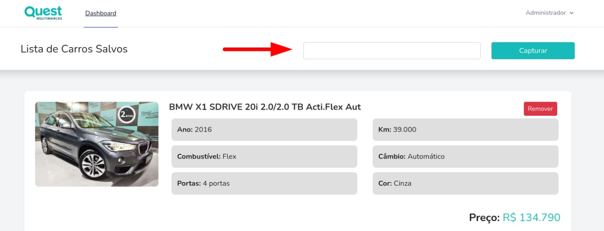

<p align="center">
    <a href="https://www.questmultimarcas.com.br/estoque" target="_blank">
        
    </a>
</p>

# Quest Multimarcas - lista de carros através de busca

Sistema que realiza uma busca no site [Quest Multimarcas](https://www.questmultimarcas.com.br), trazendo os carros pesquisados e salvando no banco de dados.

 O sistema conta com:

- Cadastro de usuários Administrativo;
- Login de usuários Administrativo;
- Busca de carros através de palavra-chave;
- Persistência dos dados em base de dado MYSQL;
- Opção de remover os carros salvos;
- Não permite salvar o mesmo carro no banco de dados.

## Tecnologias utilizadas

As tecnologias utilizadas para este projeto são:

- **[Apache](https://www.apache.org/)**
- **[PHP](https://www.php.net/)**
- **[Laravel](https://laravel.com/)**
- **[Mysql](https://www.mysql.com/)**
- **[Bootstrap](https://getbootstrap.com/)**
- **[Jquery](https://jquery.com/)**

## Instruções para uso

Considerando que você possua um servidor configurado com PHP em versão igual ou superior a 7.4, o SGBD Mysql instalado e um servidor como Apache, basta seguir os seguintes passos:

- Criar uma base de dados com o nome "quest_scrapping" ou caso queira um nome diferente, deverá também alterar o valor DB_DATABASE no arquivo .env (linha 13) da aplicação;
- Certificar-se de que o valor DB_USERNAME e DB_PASSWORD no arquivo .env corresponde aos dados de um usuário mysql válido em seu ambiente;
- Clonar o repositório atual via terminal/cmd dentro de alguma pasta em seu servidor;
- Entrar na pasta do repositório via terminal/cmd;
- Dar permissão de leitora e escrita em sua pasta de forma recursiva:

```
   sudo chmod -R 777 ./ 
   
```

- Executar os comandos abaixos:

```
    php artisan migrate // para executar a migração dos dados para seu banco de dados
    npm install && npm run dev // para instalar dependências externas
    php artisan serve // para rodar a aplicação em seu servidor
```

Após se registrar/logar, basta efetuar uma busca no campo abaixo para que seja feita a captura de carros cujo filtro atende seu pedido

 

#### Na estrutura atual do projeto existe um dump de testes (database/dump/quest_scrapping.sql) caso queira iniciar a aplicação sem precisar rodar o comando php artisan migrate. O projeto não foi buildado para que seja observado com mais clareza o código escrito na aplicação.